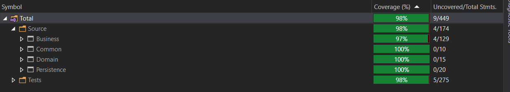

# Table of contents
- [Storage service](#storage-service)
  * [Introduction](#introduction)
- [Backend project](#backend-project)
  * [Technologies and packages:](#technologies-and-packages)
  * [Architecture](#architecture)
  * [Build and run](#build-and-run)
    + [Docker](#docker)
    + [Tests](#to-run-test)
      - [Coverage](#coverage)
    + [Deployment](#deployment)
- [Other projects](#other-projects)
- [Discussion and improvements](#discussion-and-improvements)
  * [Database choices and how to improve ?](#database-choices-and-how-to-improve-)
    + [Problem](#problem)
    + [Requirements](#requirements)
    + [Databases:](#databases)
      - [General features to model this kind of problem](#general-features-to-model-this-kind-of-problem)
        * [Relational databases:](#relational-databases)
        * [NoSQL databases](#nosql-databases)
        * [New kids on the block](#new-kids-on-the-block--fauna-db)
     * [Summary and reflection](#summary-and-reflection)

# Storage service

## Introduction:

### [View on heroku](https://storage-app-p3.herokuapp.com/api/index.html) 

The service API should be implemented using .NET Core Web API.

It should contain endpoints for:
* Creating, deleting files
* Querying files in "starts with" fashion and inside specific folder / across all files.
    * Retrieve only top 10 results
* Creating, deleting folders

For scope reduction we'll say folders and files are basic structures having only names. 
No authentication and authorization is required.

### Start

Clone repo

Make sure you have admin rights

# Backend project:
## Technologies and packages: 
* .Net Core 3.1
* MediatR
* Fluent validation
* Swagger 
* NLog
* MSSQL Server as database of choice for simple PoC 

## Architecture
Classic NLayered architecture: Presentation - Business - Persistence - Domain 

## Build and run:
.Net Core 3.1 - VS19 so if you're using something else say VSCode use CLI
* Open project
* Set API project as startup
* Create <code>appsettings.Development.json</code>-> Use <code>appSettings.json</code> as cook-book
* Start <code> https://localhost:44302/api/index.html </code>

### Docker
<code>run docker-compose -f docker-compose.yml -f docker-compose.override.yml up --build -d </code>

Dependancies are SQL server and SEQ for structured logging 

### To run test
* Open test project and run unit tests or write `dotnet test`

#### Coverage:

 

### Deployment

#### Heroku
As a free resource and easy to setup I deployed this app on Heroku via build docker image pushed to heroku registry and released there

[View on heroku](https://storage-app-p3.herokuapp.com/api/index.html) 

https://medium.com/better-programming/how-to-containerize-and-deploy-apps-with-docker-and-heroku-b1c49e5bc070

#### Azure / Cloud

Azure deployment on to AK8S

App needs some more work for this

Eshoponcontainers reference app has good [wiki](https://github.com/dotnet-architecture/eShopOnContainers/wiki/Deploy-to-Azure-Kubernetes-Service-(AKS)) on kuberentes deployment

# Other projects
Feel free to check out some other repositories on my github

# Discussion and improvements
Problem
* Hierarchical data
* Potentially <b>a lot</b> of nested data

## Database choices and how to improve ?

I understand the task was supposed to check on my code writing and organizing skills. 

I feel like time limit was a tiny bit low if we wish to do this problem right. 

So, I’ll try to write some additional thoughts below on what we can consider and how to implement solution.

### Problem:
Structured file management system containing potentially limitless depth and limitless children per level.

### Requirements:
* Fast query times across file system
* Fast insertion and deletion times

### Databases:
•	Relational
•	Document
•	Graph

Generally speaking, we’ll have to decide between fast read or fast write times. But we can opt to emphasize on optimizing write times and delegate reading to something else like ES.

#### General features to model this kind of problem
* Adjacency list
    * Easy to implement
    * Fast moves, inserts, deletes
    * Deeper queries are expensive ( tree retrieval )
* Nested sets
    * Left right columns
    * Expensive when we have more complex data
* Closure table
    * Separate table with mapped relations    
    * 1 query to remove or add relationships
    * Easy querying for depth
    * Underperforms on complex structures and writes
* Materialized path (Path enumeration)
    * Map path parent/child/grandchild/
    * Fast queries    
    * Scaling problems when paths grow

#### Relational databases:
Even though RDMS have trouble with nested structures, unknown depths and scaling (vertically only). 

Modern databases offer some tools with which we can tackle this problem.

Like [MSSQL HierarchyId](https://docs.microsoft.com/en-us/sql/t-sql/data-types/hierarchyid-data-type-method-reference?redirectedfrom=MSDN&view=sql-server-ver15) for storing position in hierarchy or recursive query support.

My implementation was initially with self referencing table but that just introduced a bit more complex and slower queries.
However, even though EF Core states it released support for HierarchyId I didn't really see that. 
So I opted out to implementing my own HierarchyId with aid of HierarchyIdHelper.

It introduced really far more simple deletions and queries of children nodes..and coupled with good indexes and some tricks it can yield good performance.

#### NoSQL databases:

##### Wide column document
Great for small scale hierarchical data with relatively small amount of children for each entry. 

More flexible and data structure is not fixed. Can scale horizontally.

MongoDb offers some guidelines on how to model tree structures in their database on following resource:

https://docs.mongodb.com/manual/applications/data-models-tree-structures/

1)	Parent references
2)	Child references
3)	Array of ancestors
4)	Materialized paths
5)	Nested sets

##### Graph databases

These databases are a way to go if we have deep and stretched out data. Where relationships take first priority. 

They allow for deep traversals, faster then other databases. Fast when searching relationships.

Cons?
* They are still a relatively new growing technology?
* Developer knowledge?

Glimpse on how [Neo4J](https://neo4j.com/graphgist/enterprise-content-management-with-neo4j) would tackle content management system

Other things that come to mind:
*	Sync data to some full text search engine like ES for fast querying when searching for files
*	Cache search results to improve performance
*	If you have trouble deleting folder nodes
    * Perhaps make it a async background process
        * With server push once it’s done via sockets.
*	Since our databases will only keep records… we will actually store files on some blob storage say S3 or Azure variant..

##### New kids on the block ? [Fauna DB](https://fauna.com/)
* Use GraphQL to query the database
* Under the hood Fauna decides which of the 7 dabase paradigms to best use based on GraphQL query
* ACID compliant, Fast, less worry about infrastructure

#### Summary and reflection

Personally, I’d probably go with Mongo + ES + Blob storage DA layer. 
With some caching mechanism. If we have lots of data to delete, I’d probably utilize that async deletion with server push to let the client know that process is done.

